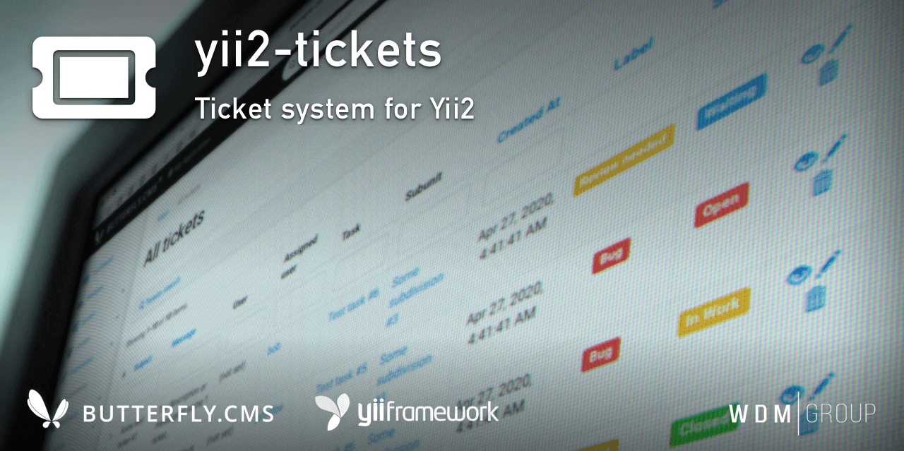

# Yii2 Tickets Module
Ticket system for Yii2.
                      
This module is an integral part of the [Butterfly.СMS](https://butterflycms.com/) content management system, but can also be used as an standalone extension.

Copyrights (c) 2019-2021 [W.D.M.Group, Ukraine](https://wdmg.com.ua/)

# Requirements 
* PHP 5.6 or higher
* Yii2 v.2.0.40 and newest
* [Yii2 Base](https://github.com/wdmg/yii2-base) module (required)
* [Yii2 Editor](https://github.com/wdmg/yii2-editor) module
* [Yii2 Tasks](https://github.com/wdmg/yii2-tasks) module (optionaly)
* [Yii2 Users](https://github.com/wdmg/yii2-users) module (optionaly)

# Installation
To install the module, run the following command in the console:

`$ composer require "wdmg/yii2-tickets"`

After configure db connection, run the following command in the console:

`$ php yii tickets/init`

And select the operation you want to perform:
  1) Apply all module migrations
  2) Revert all module migrations

# Migrations
In any case, you can execute the migration and create the initial data, run the following command in the console:

`$ php yii migrate --migrationPath=@vendor/wdmg/yii2-tickets/migrations`

# Configure
To add a module to the project, add the following data in your configuration file:

    'modules' => [
        ...
        'tickets' => [
            'class' => 'wdmg\tickets\Module',
            'routePrefix' => 'admin'
        ],
        ...
    ],

# Routing
Use the `Module::dashboardNavItems()` method of the module to generate a navigation items list for NavBar, like this:

    <?php
        echo Nav::widget([
        'options' => ['class' => 'navbar-nav navbar-right'],
            'label' => 'Modules',
            'items' => [
                Yii::$app->getModule('tickets')->dashboardNavItems(),
                ...
            ]
        ]);
    ?>

# Status and version [ready to use]
* v.1.1.9 - Update dependencies, README.md
* v.1.1.8 - Added pagination, up to date dependencies
* v.1.1.7 - Fixed deprecated class declaration
* v.1.1.6 - Added extra options to composer.json and navbar menu icon
* v.1.1.5 - Added choice param for non interactive mode
* v.1.1.4 - Module refactoring